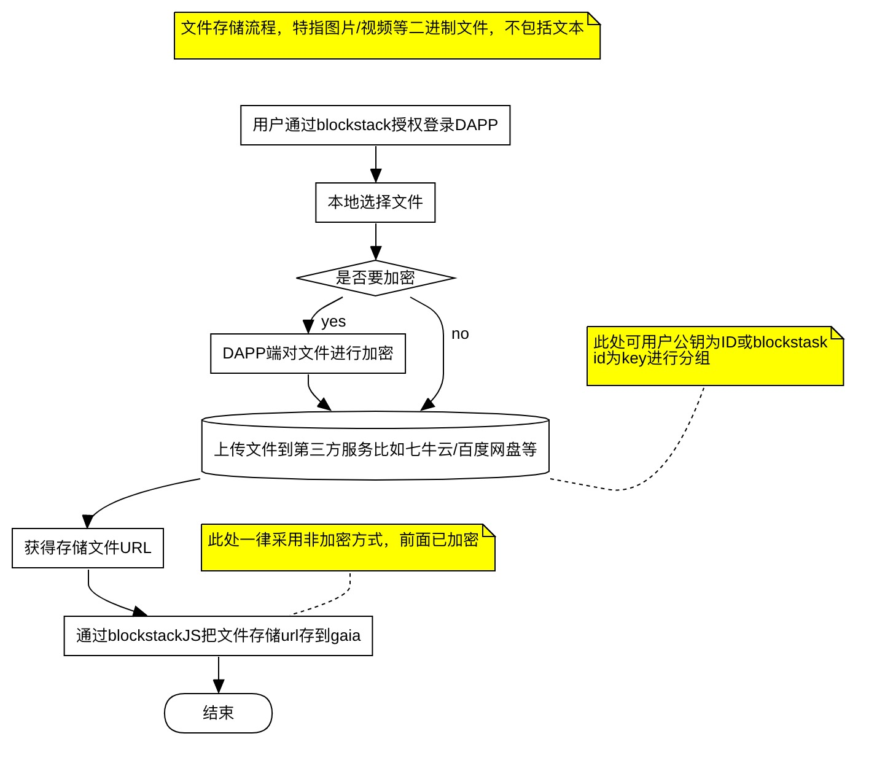
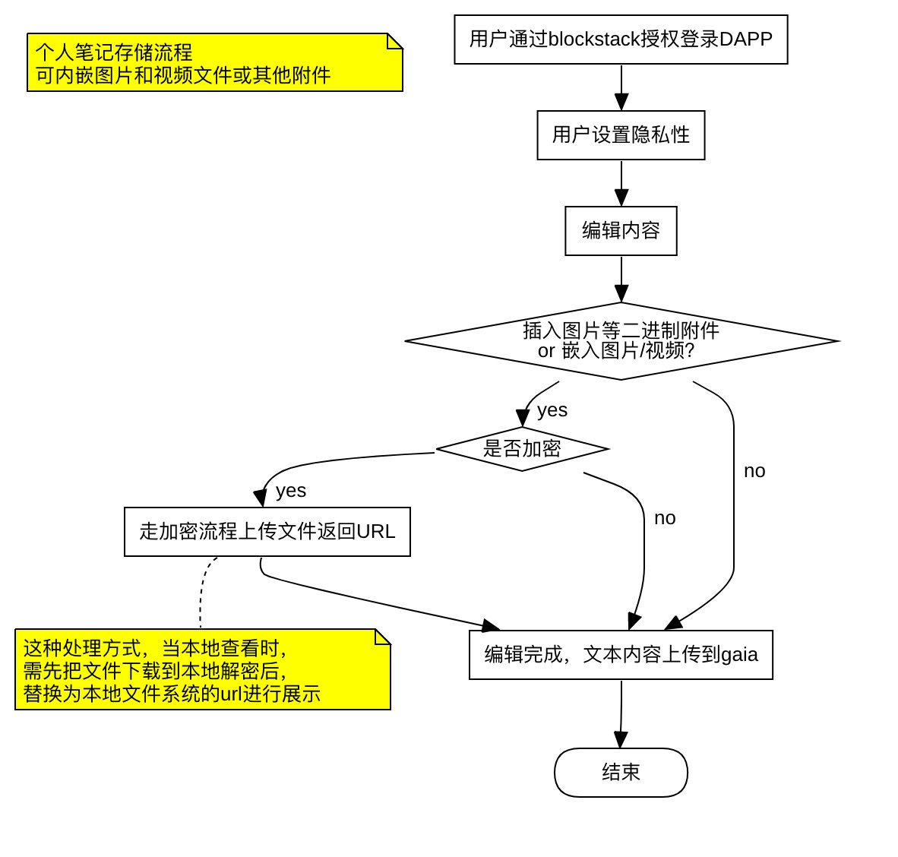
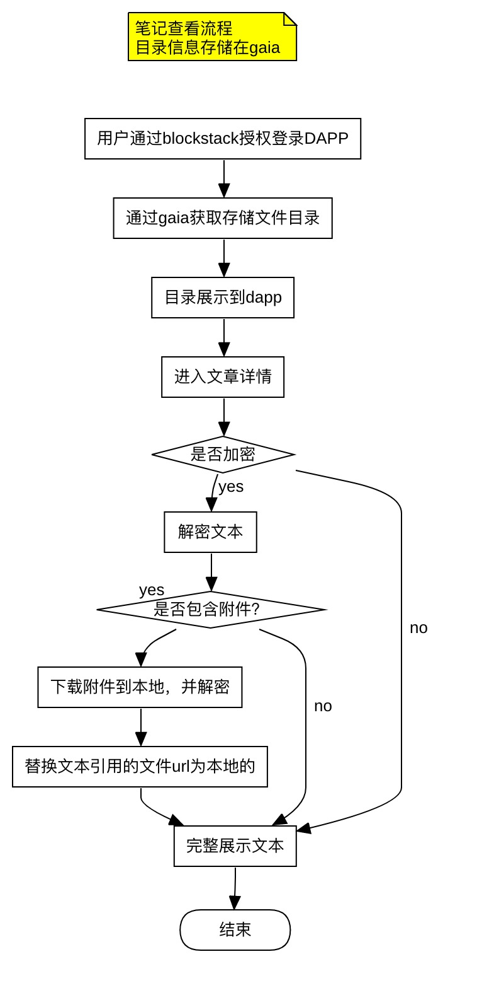

# PIMStack

## 简介
一个基于区块链的个人信息管理系统PIM，主要用于个人信息管理。

保护个人隐私，控制可见性，未来为自己的信息收费。


以下两段摘自[维基百科](https://zh.wikipedia.org/wiki/%E4%B8%AA%E4%BA%BA%E4%BF%A1%E6%81%AF%E7%AE%A1%E7%90%86%E7%B3%BB%E7%BB%9F)

```
个人信息管理系统（Personal information manager，简称PIM）是一种提供个人信息组织管理功能的应用软件。其目的是为了便于记录、跟踪和管理各种个人信息。

英国标准协会（BSI）于2009年正式发布BS 10012:2009个人信息管理体系(Personal Information Management System, PIMS)，此标准具体说明了对个人信息管理体系的各项要求，是对ISO27001信息安全管理体系在个人信息保护方面的进一步深化，以在个人数据利用与保护之间进行合理的平衡。[1]

```

```

 个人信息管理系统一般包括以下功能：
    个人笔记／日志
    地址簿
    列表（包括任务列表）
    重要日期日历
    生日
    庆祝日
    约见日
    电子邮件
    传真通信
    项目管理功能
    RSS/Atom 输出

```


## 计划的功能点

1. 笔记/日记
2. 看板(基于项目的任务管理)
3. 日历视图
4. 番茄工作法及时
5. 文件(图片视频等)
6. 共享（可以是基于某一主题的资料分享）
7. ...


## 流程图

###文件存储流程


###笔记存储流程



###笔记查看流程




